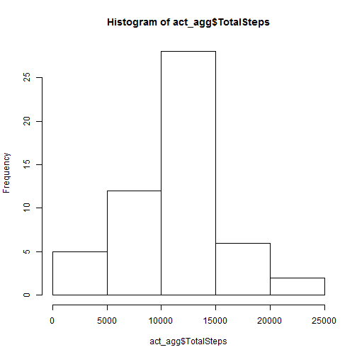
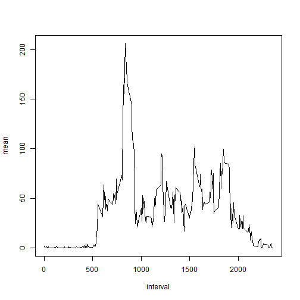
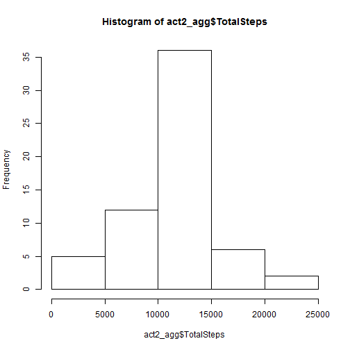
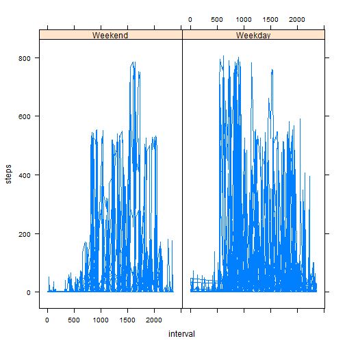

# Markdown file for Reproducible research

By Steven Zwart
17-09-2015

## First step: load data

Go to the directory where the file activity.csv has been downloaded and load and prepare the data


```r
act <- read.csv("activity.csv")
act$date <- as.Date(act$date, "%Y-%m-%d")
act1 <- act[!is.na(act$steps),]
act_agg <- aggregate(act1$steps, by=list(act1$date), sum)
colnames(act_agg) <- c("Date", "TotalSteps")
```

## What is the mean total number of steps taken per day?


```r
hist(act_agg$TotalSteps)
```

 

```r
mean(act_agg$TotalSteps)
```

```
## [1] 10766
```

```r
median(act_agg$TotalSteps)
```

```
## [1] 10765
```

## What is the average daily activity pattern?

For this I will use the library dplyr, so that should be installed, this can be done with

install.packages("dplyr")


```r
library (dplyr)
df <- group_by(act1, interval) %>% summarise(mean=mean(steps))
plot(df, type = "l")
```

 

```r
sprintf("The 5 minute interval that contains on average the maximum number of steps is %s.", df[which(df$mean==max(df$mean)),]$interval)
```

```
## [1] "The 5 minute interval that contains on average the maximum number of steps is 835."
```

## Imputing missing values

Total number of missing values


```r
sprintf("The total number of missing values in the dataset is %s. ", sum(is.na(act)))
```

```
## [1] "The total number of missing values in the dataset is 2304. "
```

```r
# act2 will have the missing values imputed
act2 <- act
# Impute missing values (steps): use mean of that particular interval 
for (i in 1:nrow(act2)) {
  if (is.na(act2[i,1])) {
    avg <- df[which(df$interval == act2[i,]$interval),]$mean
    act2[i,]$steps <- round(avg)
  }
}
act2_agg <- aggregate(act2$steps, by=list(act2$date), sum)
colnames(act2_agg) <- c("Date", "TotalSteps")
hist(act2_agg$TotalSteps)
```

 

```r
mean(act2_agg$TotalSteps)
```

```
## [1] 10766
```

```r
median(act2_agg$TotalSteps)
```

```
## [1] 10762
```

Weekdays


```r
# Set language to English (Windows)
Sys.setlocale("LC_TIME","C")
```

```
## [1] "C"
```

```r
act2$weekday <- NA
for (i in 1:nrow(act2)) {
  if (weekdays(as.Date(act2[i,]$date)) %in%  c("Saturday", "Sunday")) {
    act2[i,]$weekday <- "0"
  } else {
    act2[i,]$weekday <- "1"
  }
}
library(lattice)
act2$weekday <- as.factor(act2$weekday)
 xyplot (steps~interval|weekday, data= act2, type = "l", layout = c(2,1), strip=strip.custom(factor.levels = c("Weekend", "Weekday")))
```

 


